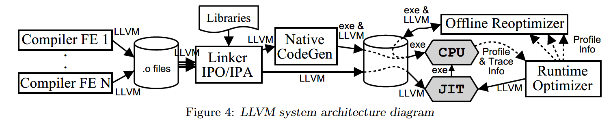

# LLVM(Low Level Virtual Machine) Note
## Abstratct
- Static Single Assignment(SSA)
  - language-independent
  - for typed address arithmetic
  - handle exception
- evaluation
  - size and effectiveness of representation
  - performance for interprocedural problems
  - LLVM's benifits for challenging compiler problems

## Instroduction
- Lifelong optimization
  - link-time:interprocedural optimization
  - install time：machine-dependent optimization
  - runtime: dynamic optimization
  - idle time: profile-guided optimization
  - flexible; allow application ion new systems
- LLVM
  - aim: make lifelong program analysis and transformation available for arbitrary software; transparent for programmers
    - a code representation: novel features
    - a compiler design: combination of new capabilities
  - novel features
    - a low level ,language-independent type system can implement data from high-level language
    - type conversions and low-level address while preserving type information
    - 2 low-level exception-landling instructions
  - reason for source-language-independent
    - instruction set and mem: slightly richer than assembly languagea
    - do not require particular runtime
  - a complementary to high-level VM
    - has no notion of high-level constructs
    - do not specify a runtime system or object model
    - do not guarantee type safety, mem safety, language interoprability
-  5 capabilities for lifelong analysis and transformation for arbitrary program
    - persistent program info
    - offline code generation
    - user-based profiling and optimization
    - tranparent runtime model
    - uniform, whole-program compilation
- effectiveness evaluation
  - size and effectiveness of representation, extract useful type info
  - compiler performance(without dependence on particular generator)
  - capability for challenging compiler problems
- experimental results
  - extract reliable info for 68% static mem access across SPECINT 2000 C benchmarks
  - capture type info safely to aggressive transformations
  - code size: X86 machine code (CISC), 25% smaller than RISC; capture much richer type info as SSA
  - runtime: JVM, CLI

## 2.Program Representation
- 2.1 Overview of LLVM Inst Set
  - infinite set of typed virtual regs: hold primitive types
  - load/store architecture
  - 31 opcodes
    - avoid mutiple opcodes for same operations; overloaded opcodes
    - 3-address form
  - regs: SSA form
    - mem location not in SSA form: stored by a pointer -> difficult to construct SSA code repre
    - phi instruction 
    - non-loop transformations, non-memory transformations
  - Control Flow Graph(CFG) of each func
- 2.2 language-independent type info, cast, and GetElementPtr
  - predefine sizes of source-language-independent primitive types
  - 4 derived types: pointer, array, structure, function(high-level languages often use)
  - declared type info is not reliable 
    - use pointer analysis algorithm to distinguish type of poiter target
    - reliable type info for most mem accesses in C
  - "cast" inst: convert a value of one type to another(the only way)
  - "getelementptr" inst
    - perform pointer arithmetic, both preserves type info and has machine-independent semantics
    - given a typed pointer to aggregate typed object, it caculates address of a sub-element, type-preserving
- 2.3 Explicit Memory Allocation and Unified Memory Model
  - inst `malloc`: allocate mem on heap, returning a typed pointer
  - inst `free`: release mem
  - inst `alloca`: similar to `alloc`, allocate mem in stack
- 2.4 Function Calls and Exception Handling
  - inst `call`: for usual func calls, take a typed func pointer 
  - exception handling(in high-level language): explicit, low-level, machine-independent mechanism; support `setjmp`, `longjmp` in C
  - `invoke` and `unwind`: support abstract exception, based on stack unwinding #??
    - `invoke`: specify exception handling code that must be executed during stack unwinding
    - `unwind`: throw an exception or to perform a longjmp
    > unwind 所要做的事情就是从抛出异常的函数开始，沿着调用链向上找到 catch 所在的函数，然后从抛异常的地方开始，清理调用链上各栈帧内已经创建了的局部变量。类似于函数调用的逆过程。
- 2.5 Plain-text, Binary, and In-memory Representations
  - LLVM -- a first class language
  - inst set: a persistent, offline code representation & a compiler internal representation, no conversion

## 3. Compiler Architecture
- 3.1 High-Level Design of the LLVM Compiler Framework
  - Linker: link-time optimization, interprocedural
  - LLVM code -> native code(link-time or install-time)
  - native code generator detects frequently executed code regions(loop etc. optimized at runtime)
  - offline optimizer(idle time): target machine
  - 5 benifits provided
    - persistent program info
    - offline code generation
    - user-based profiling and optimization
    - tranparent runtime model
    - uniform, whole-program compilation
  - difficult simultaneously
  - no existing compiler has all 5 above

- 3.2 Compile-Time: External front-end & static optimizer
  - external static LLVM compiler = front-ends: 
    - source-language program -> LLVM virtual inst set
    - 3 tasks(1st and 3rd optional)
      - language-specific optimizations
      - Translate source programs to LLVM code
      - Invoke LLVM passes for global or interprocedural optimizations at the module level
  - needn't perform SSA form, variables allocated in stack
  - scalar expansion: expand local structures to scalars
  - many “high-level” optimizations are not really language-dependent
- 3.3 Linker & Interprocedural Optimizer
  - link-time: natural place for aggressive interprocedural optimization
  - link-time optimization in LLVM: use existing semantic info
  - LLVM uses well-known technique to speed up interprocedural analysis
    - compile-time: compute interprocedural summaries -> link-time: summaries as input of interprocedural optimizer 
- 3.4 Offline or JIT Native Code Generation
  - code generator: translate LLVM to native code, 2 ways:
    - 1. run statically at link time or install time, using expensive code genetation techniques
    - 2. use post-link (runtime and offline) optimizers, copy LLVM bytecode to executable(可执行文件)
  - JIT, just-in-time Execution Engine: invokes appropriate code generator at runtime, translating one function at a time for execution 
  - both insert light-weight instrumentation into the program to identify frequently executed regions of code
- 3.5 Runtime Path Profiling & Reoptimization
  - execution paths identified by offline and online instrumentation
    - offline instrumentation(by native code generator): indentify frequently executed loop regions 
    - runtime instrumentation library instruments the executing native code to identify frequently-executed paths
  - advantages
    - 1. Native code generation can be performed ahead-of-time with high-performance
    - 2. native code generator and runtime optimizer can work together 
    - 3. runtime optimizer can use high-level info
- 3.6 Offline Reoptimization with End-user Profile Information
  - LLVM representation preserved permanently, enables offline optimization during idle-time on end-user’s system
  - benefits
    - use profile info from end-user runs of application
    - tailor the code to detailed features of a single target machine
    - perform much more aggressive optimizations because it is run offline

## 4. Applications and Experiences
- 4.1 Representation Issues
  - *4.1.1 What value does **type information** provide?*
    - Data Structure Analysis(DSA): flow-insensitive, field-sensitive and contextsensitive points-to analysis
  - *4.1.2 How do high-level features map onto LLVM?*
    - even low-level language as C, has features that must be lowered by compiler targetign LLVM
    - example: C++
  - *4.1.3 How compact is the LLVM representation?*
    - compiled program stored in LLVM representation and cannot be too large
    - LLVM code is about the same size as native X86 executables 
    - large program(more regs) are encoded less efficiently than smaller ones; 32-bit -> 64-bit
  - *4.1.4 How fast is LLVM?*
    - the optimization time less than compiling the program with GCC
    - interprocedural optimizations scale mostly linear with the number of transformations
- 4.2 Applications using life-time analysis and optimization capabilities of LLVM
  - *4.2.1 Projects using LLVM as a general compiler infrastructure*
    - i.e., Data Structure Analysis (DSA) and Automatic Pool Allocation inherit benefits from LLVM:
      - e.ective if most of the program is available, i.e., at link-time
      - type info is crucial for effctiveness
      - source-language independent
      - SSA significantly improves precision of DSA, which is flow-insensitive
  - *4.2.2 SAFECode: A safe low-level representation and execution environment*
    - enforce mem safety of programs through static analysis, using a variant of automatic pool allocation and using extensive interprocedural static analysis to minimize runtime checks
  - *4.2.3 External ISA design for Virtual Instruction Set Computers*
    - Virtual Instruction Set Computers use 2 distinct inst sets:
      - V-ISA: externally visible, virtual instruction set, as program representation for all software
      - I-ISA: hidden implementation-specific instruction set, actual hardware ISA
## 5. Related Work
